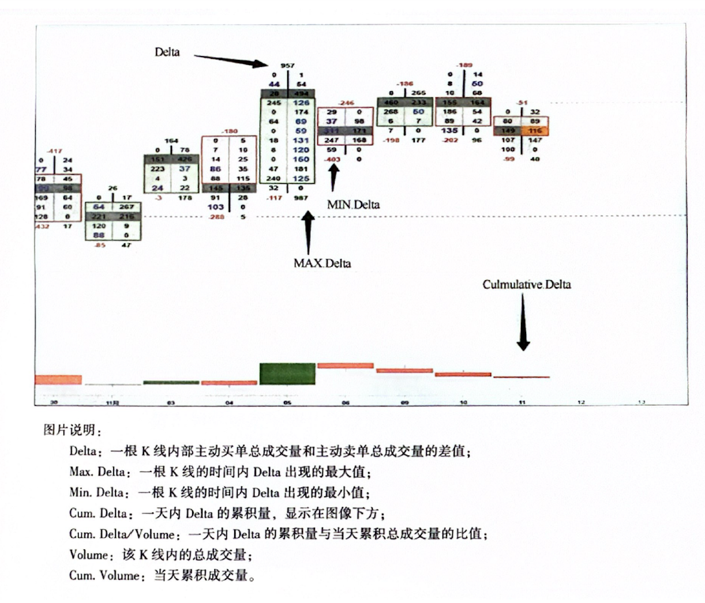

*** 笔记中的设置以书本配色、设定为准。***

### 一、简介

最基本规则：通过双方挂单，市场总是存在最新的买入价（买一）和卖出价（卖一）；如果不想等待，可以主动市价成交（比如卖一买入，或者买一卖出）。

订单流：显示成交量和价格，快速反映市场即时行为的一种手段，重点在于分离开市场交易流水，展现主动买卖单的数量，形成”订单流足迹“。

传统K线图：

+ 实体：蜡烛图的厚实部分，代表开盘价和收盘价之间的区域。它的颜色和位置提供了看涨/看跌信息。
+ 影线：线条从实体向上或向下延伸，标示了在该时间段内的最高价和最低价。

### 二、市场基本指标

#### 1. 价格

交易的根本目标：高抛低吸。

价格变动：一般来说，买少于卖价格下跌，卖少于买价格上涨。

+ 价格上涨是因为推动市场上涨的主力暂时还未决定要获利出局，这些主力往往在趋势开始之前就已经进入了市场，所以在主力还没出来之前，价格总是会继续上涨。如果主力机构想要将价格带到更高的区间，他们会主动吸收涌入市场的卖单。主力们不会发力支撑整个市场，他们在察觉到这个价格趋于薄弱的情况下才主动吸收。

  上涨趋势终止的情况：买方在当前价位不愿意再继续买；买方已经耗尽了所有的力气；卖方强势压倒了买方。

+ 价格下跌并不仅仅因为供应比需求更胜一筹。可能是没有足够的买单来止住这个下跌的趋势。在下跌的环境下，委托的买入单非常少，价格就会下跌。这也是下跌的速度往往要比上涨速度快的原因。

  下跌趋势的终止的情况：卖方不愿意再该点位继续卖；卖方已经清空了自己的存货；卖方被强势的买方吞没。

+ 市场转折并不总是非常清晰或者典型，但是如果上面的情况出现，要保证牢牢抓住盈利机会。

#### 2. 成交量

传统分析的问题：不能区分代表买卖何方力量，不能判定即时状态。

既有事实：

+ 上涨趋势中，主动买单量应该有所增长，这意味着强势的需求横扫了所有价位上挂的卖单。

+ 下跌趋势中，主动卖单量应该增长，这意味着卖方正在将自己手申的仓位甩给挂单的买方。

+ 而在牛皮市行情下，市场像一块海绵，砸向市场的卖单和买单都被吸收。

交易策略：要把成交量和价格结合，抓住K线内部不同价位的成交情况，深入理解市场。

#### 3. Delta

Delta 内涵：一根K线内主动买单和主动卖单成交量总和的差值。空头主导，Delta 为正；多头主导，Delta 为负。

盘整阶段，Delta 正负小幅度调整；吸收过程，Delta 几乎为0。Delta 绝对值的比较务必限定时间和图标规模。

#### 4. POC

POC内涵：预示着在一根K线中，这个点位买卖单成交量最活跃。

位置分析：如果市场处于中性震荡状态，POC保持在中部，反映了市场参与者心中“合理”的交易位置。

但是如果POC出现在K线顶部或者底部，考虑主力动力。

+ 下跌过程POC在底部但是价格收盘在高位，多头力量可能在支撑推动市场，通常是看涨的信号；
+ POC在顶部但价格在低位，主动型买方试图推动市场，被更强大的卖方主导了市场，因此通常是看跌的信号。

### 三、市场中的交易

#### 1. 基本分析

认知：期货市场并不总是零和博弈，也可能用于做空期货来对冲现货的风险，也有可能用于套利修复市场间价差。

买方和卖方：

+ 大量买方出现：大量投资者吃掉卖单进入市场，或者空头大量结算；
+ 大量卖方出现：卖方大量抛售，或者买进空头；

空头和多头：

+ 大量被动型多头出现：价格下方大挂买单，价格下跌导致限价单大量成交；

+ 大量被动型空头出现：投资者不断收购筹码，看跌动能加强；

限价单和市价单

+ 委托市价单：希望迫切进入市场，通常引起波动；
+ 限价单：形成支撑位和阻力位，可能引起大规模反转。

#### 2. 主动型交易者

价格趋势：大量主动型买方涌入，市场价格上涨；大量主动型卖方进入，价格下跌。

供需关系：市场交易的每一笔成交，总会有一个买方一个卖方。某价位出现主动型买方，指的是主动型买方的成交量远远大于主动卖方的成交量，市场出现抛售行为。

#### 3. 被动型交易者

价格趋势：被动型往往是机构交易者，作为阻力或者支撑，在K线顶部或者底部阻挠了趋势变化。

#### 4. 市场失衡

基本概念

